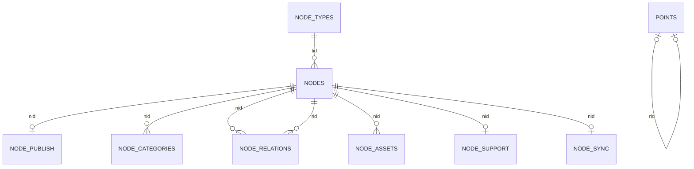

# База данных Node

Статус: проектирование завершено; реализация и её проверки выполняются по 13-testing.md и 14-roadmap.md.

## Цель

Описать окончательную реляционную модель, индексы, транзакционные границы и правила расширения схемы до появления первого SQL-файла.

## Утверждённые таблицы

| Таблица | Ответственность |
|---|---|
| `_nodes` | общие данные, основная категория, состояние и счётчики материалов |
| `_node_types` | зарегистрированные типы, их состояние и публичная идентичность |
| `_node_categories` | связи материала с дополнительными категориями |
| `_node_relations` | типизированные связи между материалами |
| `_node_assets` | связи материалов с несколькими структурированными ресурсами существующего файлового слоя |
| `_node_support` | очередь и рабочее состояние обращений технической поддержки |
| `_node_sync` | источник, расписание и результат фонового обновления внешнего материала |
| `_node_publish` | доставка начисления за отложенную публикацию |
| `_rating_targets`, `_rating_actors`, `_rating_votes` | общий рейтинг; полный контракт в ratings.md |
| `_points` | глобальный неизменяемый журнал событий пользовательских баллов |

Имена указываются без значения `PREFIX_DB`; в DDL установки используется `{prefix}`, а runtime обращается через `PREFIX_DB`.

Основная и дополнительные категории имеют разные канонические источники: `_nodes.cid` хранит ровно одну основную категорию, а `_node_categories` — только дополнительные. Основная категория не дублируется в связующей таблице.

## Состояние решений

Модель фиксирует целевой состав Node. Общие Point/Rating вынесены в points.md/ratings.md; _node_publish добавлена по решению о начислении при наступлении отложенной публикации. Исполняемый DDL и проверка установленной схемы относятся к реализации.

## ER-диаграмма согласованной части Node



Имена на диаграмме соответствуют таблицам с префиксом установки. Она показывает только внешние ключи: пользователь, основная и дополнительная категории и опрос являются проверяемыми приложением ссылками без FK. Две связи `NODE_RELATIONS` означают исходный и целевой материалы. У материала не более одной строки каждого специализированного расширения; совместимость с единственным `ext` проверяет сервис. У события Point не более одной компенсации, а компенсация относится к одному исходному событию. Схема Rating добавляется после согласования модели голоса.

## Идентификатор материала

- `_nodes.id` — единственный глобальный идентификатор материала и первичный ключ таблицы.
- `id` выдаётся новой системой и не зависит от типа материала.
- Отдельные `route_id`, `legacy_id` и таблица соответствия старых ID в рабочей схеме не создаются.
- Тип материала не входит в состав первичного ключа.
- Категории, комментарии, связи, ресурсы и другие интеграции ссылаются на глобальный `id`.
- Импорт старых таблиц и соответствие их ID не входят в текущий план Node.

## Утверждённые колонки материала

| Колонка | SQL-тип | Назначение |
|---|---|---|
| `id` | `INT UNSIGNED NOT NULL AUTO_INCREMENT` | глобальный идентификатор материала |
| `tid` | `INT UNSIGNED NOT NULL` | идентификатор типа материала |
| `cid` | `INT UNSIGNED NOT NULL DEFAULT 0` | идентификатор основной категории |
| `uid` | `INT UNSIGNED NOT NULL DEFAULT 0` | идентификатор зарегистрированного автора |
| `aname` | `VARCHAR(25) NOT NULL DEFAULT ''` | сохранённое имя автора |
| `ip` | `VARCHAR(45) CHARACTER SET ascii COLLATE ascii_bin NOT NULL DEFAULT ''` | нормализованный IP создания материала |
| `title` | `VARCHAR(100) NOT NULL` | заголовок материала |
| `intro` | `TEXT NOT NULL` | краткое содержание |
| `body` | `MEDIUMTEXT NOT NULL` | полный текст материала |
| `field` | `MEDIUMTEXT NOT NULL` | именованные значения дополнительных полей в JSON |
| `poll` | `INT UNSIGNED NOT NULL DEFAULT 0` | идентификатор подключённого опроса |
| `home` | `BOOLEAN NOT NULL DEFAULT 0` | признак публикации на главной странице |
| `comon` | `TINYINT UNSIGNED NOT NULL DEFAULT 0` | режим комментариев: отключены, с модерацией или открыты |
| `pinned` | `BOOLEAN NOT NULL DEFAULT 0` | признак закреплённого материала |
| `comnum` | `INT UNSIGNED NOT NULL DEFAULT 0` | кешированное количество комментариев |
| `views` | `INT UNSIGNED NOT NULL DEFAULT 0` | количество просмотров |
| `score` | `INT UNSIGNED NOT NULL DEFAULT 0` | сумма поставленных оценок |
| `ratings` | `INT UNSIGNED NOT NULL DEFAULT 0` | количество поставленных оценок |
| `status` | `TINYINT UNSIGNED NOT NULL DEFAULT 0` | состояние материала |
| `version` | `INT UNSIGNED NOT NULL DEFAULT 1` | версия текущего состояния для защиты от одновременной записи |
| `created` | `DATETIME NOT NULL DEFAULT CURRENT_TIMESTAMP` | дата создания |
| `updated` | `DATETIME NOT NULL DEFAULT CURRENT_TIMESTAMP` | дата последнего изменения |
| `published` | `DATETIME DEFAULT NULL` | дата публикации |
| `expires` | `DATETIME DEFAULT NULL` | дата автоматического окончания публичной видимости |

Это полный базовый состав `_nodes`. Индексируемые специальные данные типа не добавляют новые колонки в общую таблицу и принадлежат расширению. Суффикс `_at` в именах дат не используется.

Материал не хранит универсальный массив настроек и не переопределяет конфигурацию типа. Его изменяемые особенности представлены только утверждёнными колонками, дополнительными полями, категориями, связями и ресурсами; режим отображения, права, процесс, интеграции, правила ресурсов, расширение и системные пределы всегда принадлежат типу.

### Индексы материала

| Индекс | Колонки | Обслуживаемый запрос |
|---|---|---|
| `PRIMARY` | `id` | материал, обновление и удаление по глобальному ID |
| `pub` | `tid, status, pinned, published, id` | публичный список типа |
| `cat` | `tid, cid, status, pinned, published, id` | публичный список категории типа |
| `home` | `tid, home, status, pinned, published, id` | материалы типа для главной страницы |
| `admin` | `tid, status, updated, id` | административный список типа и состояния |
| `views` | `tid, status, pinned, views, published, id` | список типа по числу просмотров |
| `title` | `tid, status, title, id` | буквенный фильтр и сортировка типа по заголовку |
| `queue` | `status, created, id` | общая очередь модерации и системные списки состояний |
| `author` | `uid, status, published, id` | публичные материалы автора |
| `ip` | `ip, created, id` | поиск источника и массовая обработка спама |
| `poll` | `poll` | поиск материалов, использующих опрос |

- Отдельные индексы на `tid`, `cid` и `status` не создаются: эти левые префиксы уже обслуживаются составными индексами.
- Отдельные индексы средней оценки и каждого сочетания категории с необязательной сортировкой не создаются до профилирования: они умножили бы стоимость записи. Сортировку типа по просмотрам обслуживает индекс `views`, буквенный фильтр и сортировку по заголовку — индекс `title`, а средняя оценка вычисляется из `score` и `ratings`.
- Публичная выборка использует точное состояние `status = 2`, а не условие вида `status != 0`.
- Опубликованный материал видим при `published <= NOW()` и одновременно `expires IS NULL OR expires > NOW()`.
- Наступление `expires` не изменяет `status`, `version` и `updated`; изменение срока редактором является содержательным изменением.
- Отдельный индекс `expires` не создаётся до профилирования реальных публичных выборок: основной диапазон списка уже задаётся через `published`.
- В каждом сортируемом индексе `id` завершает порядок и исключает нестабильную пагинацию при одинаковых датах.

### Источники данных и кеши

- При `uid > 0` колонка `aname` остаётся пустой, а актуальное имя берётся из глобальной таблицы пользователей.
- При `uid = 0` колонка `aname` хранит имя анонимного автора.
- `NodeQuery` может тем же запросом добавить в результат чтения nullable-проекции `uname` из `_users.name` и `ctitle` из основной `_categories.title`; новыми колонками `_nodes` они не являются.
- Глобальная таблица комментариев является источником записей, а `_nodes.comnum` хранит пересчитываемое количество для быстрых списков.
- `_nodes.score` хранит сумму звёзд, `_nodes.ratings` — количество оценок; средняя оценка вычисляется делением суммы на количество.
- Общая система рейтинга предотвращает повтор до истечения настроенного интервала; после него новая оценка добавляется к прежним (NOD-178). Постоянная уникальность пары «участник, цель» для всей истории голосов этому контракту не соответствует. Временный запрет повторов и история значений должны быть различимы; истечение запрета не уменьшает `_nodes.score` и `_nodes.ratings`. Точный состав таблиц и индексов Rating определён ниже, сумма и количество материала остаются агрегатами `_nodes`.
- Для зарегистрированного участника ограничение строится по `uid` и цели (NOD-179). Уникальность только по IP не защищает один аккаунт с разных адресов; обязательная уникальность IP для всех голосов ошибочно блокирует разные аккаунты. При проектировании следует отдельно различить уникальную строку текущего ограничения и множество исторических голосов того же аккаунта по той же цели. Гостевой ключ определяется отдельно следующим пунктом.
- Для гостя используется нормализованный IP и цель (NOD-181). Все гости не могут объединяться по одному `uid = 0`; с другой стороны, cookie или ID браузерной сессии не заменяют выбранный IP. История содержит множество гостевых голосов после разрешённых интервалов; физическая уникальность должна защищать текущее ограничение, не запрещая эту историю. Ключи и блокировки проектируются с отдельным учётом зарегистрированных участников.
- Гостевое и пользовательское ограничения независимы (NOD-184): требуется явное различие вида участника и пространства цели. Вход в аккаунт не переписывает `uid` у прежнего гостевого голоса и не объединяет строки по совпадению IP. Зарегистрированный голос не обновляет гостевой срок; гостевой не обновляет срок аккаунта. Старый предикат «совпал IP или аккаунт» для нового Rating не переносится.
- Изменение длительности применяется к последнему принятому голосу по NOD-185, в том числе когда прежний срок уже истёк. Его достоверное время сохраняется и после истечения срока. При принятом новом голосе отсчёт идёт от него; смена настройки не меняет голос, рейтинг или Point. Схема с единственным удаляемым по истечению ограничением недостаточна; утраченное время старых голосов нельзя восстановить предположением.
- Аннулирование доступно только главному администратору и не сбрасывает срок (NOD-187/NOD-188). При пересчёте агрегата аннулированный голос исключается, но при определении последнего принятого участия его время учитывается. Удаление строки с единственным достоверным временем или фильтр только действующих голосов для ограничения не допускаются. Время аннулирования и время голосования имеют разный смысл и не подменяют друг друга.
- Для остающихся целей начальные сумма и количество сохраняются однократно отдельно от новых голосов (NOD-189). Текущий агрегат равен остатку плюс действующие новые голоса; аннулирование меняет только известный новый вклад. Модель должна предотвращать повторный захват уже обновлённого агрегата как нового остатка при возобновлении обновления. Для утраченного старого времени новый запрет не создаётся (NOD-190); достоверные сохранившиеся ограничения переносятся независимо от остатка, не превращаясь в вымышленные голоса.
- `_nodes.ip` хранит устойчивый адрес создания материала, а журналы содержат отдельный ротируемый аудит запросов.
- Имена базовых колонок `_nodes` являются зарезервированными и не могут повторно создаваться как дополнительные поля типа.
- `version` начинается с `1` и увеличивается вместе с `updated` при каждом содержательном изменении материала, его явных связей или ресурсов.
- Форма передаёт прочитанную `version`; обновление выполняется с условием по `id` и `version` и одновременно увеличивает `version` на единицу.
- Нулевое количество изменённых строк означает конфликт с более новой записью; чужие данные не перезаписываются, а редактор получает актуальный материал.
- Конфликт не хранит копию формы в базе: контроллер сохраняет проверенные отправленные значения в текущем ответе, повторно читает актуальную запись и показывает различающиеся поля.
- Принятие актуальной версии как новой основы является отдельным явным шагом без записи; последующее сохранение снова проверяет уже актуальную `version` и может получить новый конфликт.
- Автоматический `ON UPDATE CURRENT_TIMESTAMP` не используется.
- Просмотр, комментарий, оценка и пересчёт кеша не изменяют `version` и `updated`.

## Глобальный журнал баллов

DDL, индексы, исходный баланс и журнал _points: [points.md](points.md).

## IP создания

- `_nodes.ip` использует ASCII-коллацию `ascii_bin`, достаточную для нормализованных IPv4 и IPv6.
- IP записывается при создании материала и не заменяется адресом последующего редактора.
- IP сохраняется как для анонимного, так и для зарегистрированного автора.
- Колонка индексируется для административного поиска и массовой обработки спама.
- IP не выводится публично и доступен только администраторам и модераторам с соответствующим правом.

## Дополнительные поля

`node` использует единую глобальную систему дополнительных полей SLAED, а не собственные таблицы определений и значений.

- Определения хранятся структурированными массивами в `config/fields.php` и входят в общий кеш конфигурации `config/local.php`.
- Область и набор разделяют поля разных потребителей, например `node/news`, `user/profile`, `forum/topic` и `order/customer`.
- Каждое поле имеет устойчивое имя; его значение не зависит от позиции в конфигурации.
- `_nodes.field` хранит один JSON-объект с именованными значениями; пустому набору соответствует `{}`.
- Множественное значение представляется JSON-массивом.
- Сервис принимает только зарегистрированные типы полей, проверяет структуру и сохраняет канонический JSON.
- Ограничения в десять полей нет; один набор содержит не более 256 определений.
- Отдельные `_node_fields`, `_node_values`, `_fields` и `_field_values` не создаются.
- Двойное чтение позиционной строки и JSON не допускается. Значения остающихся `account`, `forum`, `order` однократно преобразуются на этапе обновления их общего контракта до переключения рабочего кода; это отделено от исключённого импорта старых материалов в Node в `12-migration.md`.

Каждое определение содержит утверждённые ключи `title`, `intro`, `type`, `default`, `options`, `req`, `multi`, `active` и `sort`. `options` содержит только параметры, разрешённые реестром выбранного `type`; PHP-код, имя класса, SQL и серверный путь в определении запрещены.

`title` обязателен и содержит не более 255 Unicode-символов, `intro` необязателен и содержит не более 1000. Значением является обычный текст без HTML или имя существующей языковой константы; строка с начальным `_` всегда трактуется как константа и отклоняется, если она неизвестна. Пустой `intro` канонически равен `''`.

Для `select` параметр `options.items` является ассоциативным массивом вариантов по устойчивому техническому ключу. Каждый вариант содержит только `title`, `active`, `sort`; отдельного ID и таблицы вариантов нет. Отключённый вариант не принимается как новый выбор, но остаётся доступным для правильного чтения ранее сохранённых значений.

`select.items.*.title` использует тот же контракт текста или языковой константы и тот же предел 255 символов, что подпись поля.

Имя поля и ключ варианта проходят один шаблон `^[a-z][a-z0-9_]{0,31}$`. Чисто цифровые ключи, верхний регистр, национальные символы и дефис не принимаются; это сохраняет строковый тип ключа в PHP и JSON и задаёт один технический формат.

Каноническое представление значений:

| Тип | JSON-значение |
|---|---|
| `text`, `textarea`, `select`, `email`, `url` | строка |
| `bool` | `true` или `false` |
| `int` | целое число |
| `decimal` | нормализованная десятичная строка без потери точности |
| `date` | строка `YYYY-MM-DD` |
| `datetime` | строка `YYYY-MM-DD HH:MM:SS` |
| поле с `multi = true` | массив значений соответствующего типа |

- Пустая строка и пустой массив считаются отсутствием значения и для необязательного поля не записываются; `false`, `0` и `'0.00'` являются полноценными значениями.
- `min` и `max` всегда включительны: для строковых типов они считают Unicode-символы, для чисел задают значение, для дат — календарную границу, для множественного `select` — количество выбранных вариантов.
- Одиночный `select` не принимает `min` и `max`, а `bool` не принимает параметры.
- `decimal` требует `scale` от `1` до `18`, допускает не более 65 цифр всего, сохраняет ровно заданное количество знаков после точки и сравнивает точные строки без `float`; знак и десятичная точка в предел не входят, для целого значения используется `int`.
- Жёсткие пределы значения: `text` — 4096 символов, `textarea` — 262144, `email` — 254, `url` — 2048, множественный `select` — 64 выбранных значения; один `select` содержит не более 256 вариантов.
- Итоговый канонический JSON одного набора не превышает 1048576 байт и проверяется до SQL. Параметр `max` может только уменьшить предел своего типа.
- `text` обрезает края и запрещает переносы строк; `textarea` приводит `CRLF` и `CR` к `LF`, сохраняя остальной текст и отступы.
- `select` принимает только разрешённые ключи, удаляет повторы множественного значения и сортирует их по определению; `bool` принимает только `true`, `false`, `1`, `0`, `'1'`, `'0'`.
- `int` хранит знаковое 64-битное значение; `decimal` принимает обычную десятичную запись с точкой без экспоненты и запятой.
- `date` строго проверяет `YYYY-MM-DD`, а `datetime` принимает форму `YYYY-MM-DDTHH:MM[:SS]` и сохраняет `YYYY-MM-DD HH:MM:SS`.
- `email` сохраняет регистр локальной части и приводит домен к нижнему регистру; `url` принимает только абсолютный `http`/`https` или путь от корня с одним начальным `/`.
- `default` применяется только при создании, только к активному полю и только при отсутствии переданного значения; при чтении и редактировании он не подставляется.
- Изменение `default` не меняет ранее сохранённые материалы.
- `active = false` исключает поле из формы и вывода, но сохраняет имеющееся значение; сочетание `active = false` и `req = true` является ошибкой определения.
- `req` проверяется для `Pending` и `Published`; `Draft` и `Disabled` могут оставаться незавершёнными.
- `default` множественного `select` является массивом уникальных активных ключей; отключённый вариант не может быть значением по умолчанию.
- При изменении форма передаёт полный набор только активных редактируемых полей. Сервис сохраняет прежние значения неактивных полей, полностью заменяет активные, удаляет отсутствующее необязательное активное значение и не доверяет скрытому вводу неактивного поля.
- Сохранённый ключ без актуального определения удаляется при следующем изменении содержимого материала; одна смена состояния JSON не переписывает.
- Перед кодированием ключи сортируются по устойчивому имени, поэтому одинаковые данные дают одинаковый JSON независимо от порядка формы.

Дополнительное поле предназначено для ввода и отображения. Если значение участвует в SQL-фильтрации, сортировке, агрегировании, уникальности или частом поиске, оно становится обычной колонкой либо индексируемыми данными зарегистрированного расширения.

## Типы материалов

Таблица `_node_types` содержит колонки в следующем порядке:

| Колонка | SQL-тип | Назначение |
|---|---|---|
| `id` | `INT UNSIGNED NOT NULL AUTO_INCREMENT` | идентификатор типа |
| `name` | `VARCHAR(50) CHARACTER SET ascii COLLATE ascii_bin NOT NULL` | уникальный технический ключ и публичное имя типа |
| `title` | `VARCHAR(100) NOT NULL` | отображаемое название типа |
| `intro` | `TEXT NOT NULL` | описание типа для администрирования |
| `ext` | `VARCHAR(50) CHARACTER SET ascii COLLATE ascii_bin NOT NULL DEFAULT ''` | ключ зарегистрированного расширения; пустая строка для стандартного типа |
| `active` | `BOOLEAN NOT NULL DEFAULT 0` | признак доступности типа |
| `sort` | `INT UNSIGNED NOT NULL DEFAULT 0` | порядок типов в административных списках |
| `version` | `INT UNSIGNED NOT NULL DEFAULT 1` | версия для защиты административного изменения |
| `created` | `DATETIME NOT NULL DEFAULT CURRENT_TIMESTAMP` | дата создания типа |
| `updated` | `DATETIME NOT NULL DEFAULT CURRENT_TIMESTAMP` | дата последнего изменения типа |

- Отдельная колонка маршрута не создаётся: публичным маршрутом является `name`.
- `name` задаётся при создании типа и после этого не изменяется. `ext` можно установить, заменить или очистить только у отключённого типа без материалов; при наличии хотя бы одного материала ключ не изменяется. Свободно редактируются `title`, `intro`, состояние, порядок и настройки уже назначенного расширения.
- Настройки, возможности и представления не хранятся в `_node_types`; они принадлежат `config/node.php` и общему кешу конфигурации.
- `ext` содержит только проверенный ключ из закрытого реестра расширений, но не имя класса, файла или серверный путь.
- Для типа достаточно признака `active`: жизненный цикл материала через `status` на тип не переносится.
- Новый тип по умолчанию отключён и становится публичным только после явной активации.
- `version` начинается с `1`; изменение данных, настроек, полей или активности типа проверяет ожидаемую версию и увеличивает её ровно на единицу вместе с `updated`.
- Открытие формы не блокирует тип, но устаревшая форма не может перезаписать более новую версию.
- Конфликт типа обрабатывается тем же способом, что конфликт материала; запись `_node_types`, `config/node.php`, `config/fields.php` и правило типа в `config/uploads.php` при несовпадении версии не изменяются.
- Счётчик материалов в `_node_types` не кешируется.

Индексы первой версии:

| Индекс | Назначение |
|---|---|
| `PRIMARY (id)` | обращение к типу по `_nodes.tid` |
| `UNIQUE (name)` | однозначный публичный маршрут и технический ключ |
| `INDEX (active, sort, id)` | стабильный список активных типов в заданном порядке |

### Вместимость прав администраторов

Для раздельной модерации динамических типов существующая колонка `_admins.modules` меняется с `VARCHAR(255) NOT NULL DEFAULT ''` на `TEXT NOT NULL`. Формат разделённых запятыми ключей остаётся прежним; физические модули используют свои имена, управление Node — `node`, а модерация типа — `node-<name>`.

- Новая таблица прав и дублирование администратора в таблицах Node не создаются.
- Колонка не индексируется и читается вместе с одной строкой администратора, поэтому смена типа не ухудшает план запросов.
- Существующие значения переносятся без преобразования; оба штатных `INSERT` администратора уже передают `modules` явно, поэтому SQL-значение по умолчанию не требуется.
- Административная форма принимает только ключи из объединённого реестра реальных модулей и зарегистрированных типов Node; произвольная строка не сохраняется.
- `TEXT` снимает прежний предел списка в 255 символов, но размер входа всё равно ограничивается фактическим количеством зарегистрированных разрешений.

## Связь материала с типом

`_nodes.tid` защищается внешним ключом:

```sql
CONSTRAINT `{prefix}_fk_nodes_type`
  FOREIGN KEY (`tid`) REFERENCES `{prefix}_node_types` (`id`)
  ON UPDATE RESTRICT
  ON DELETE RESTRICT
```

- Материал не может ссылаться на отсутствующий тип.
- Тип нельзя физически удалить, пока у него существуют материалы любого состояния.
- Для `cid`, `uid` и `poll` внешние ключи не создаются: глобальные таблицы SLAED используют значение `0` и не имеют общего контракта внешних ключей.
- Все таблицы `node` используют `InnoDB`; связь не зависит от выбранного типа материала.

## Дополнительные категории материала

Таблица `_node_categories` содержит только дополнительные категории:

| Колонка | SQL-тип | Назначение |
|---|---|---|
| `id` | `INT UNSIGNED NOT NULL AUTO_INCREMENT` | устойчивый идентификатор связи |
| `nid` | `INT UNSIGNED NOT NULL` | материал |
| `cid` | `INT UNSIGNED NOT NULL` | дополнительная категория |

Индексы и связь с материалом:

```sql
PRIMARY KEY (`id`),
UNIQUE KEY `node` (`nid`, `cid`),
KEY `cat` (`cid`, `nid`),
CONSTRAINT `{prefix}_fk_node_categories_node`
  FOREIGN KEY (`nid`) REFERENCES `{prefix}_nodes` (`id`)
  ON UPDATE RESTRICT
  ON DELETE CASCADE
```

- `_nodes.cid` является единственным источником основной категории и определяет язык и основной маршрут материала.
- `_node_categories` не содержит строку с основной категорией материала; сервис удаляет такое совпадение из нормализованного входного списка.
- `id` используется для журнала, административных действий и возможного развития связи; логическую уникальность задаёт индекс `node`.
- Индекс `node` одновременно обслуживает получение дополнительных категорий материала, а `cat` — материалы дополнительной категории.
- Внешний ключ `_node_categories.cid → _categories.id` не создаётся по общему контракту интеграционных ссылок SLAED; существование категории, её тип и права проверяет сервис.
- Значение `0` не записывается как дополнительная категория.
- Сохранение основной и полного набора дополнительных категорий выполняется одной транзакцией вместе с материалом.
- Публичная выборка категории объединяет основной индекс `_nodes.cat` и дополнительный `_node_categories.cat`, возвращая каждый материал один раз.
- Физическое удаление материала каскадно удаляет дополнительные связи; удаление глобальной категории очищает их через интеграцию категорий.

## Связи материалов

Строка `_node_relations` после чтения представлена неизменяемым `NodeRelation`, а не необработанным массивом PDO. Дополнительные категории остаются `int[]`: отдельный объект для пары `nid, cid` не несёт полезного поведения и не создаётся.

`NodeRelation` содержит `int $id`, `int $nid`, `int $rid`, `string $type`, `int $sort` и `string $created` в порядке колонок. Вложенного материала в объекте нет. Входной элемент полного набора связей содержит только `rid`, `type` и `sort`; остальные значения назначает сервис.

Таблица `_node_relations` содержит:

| Колонка | SQL-тип | Назначение |
|---|---|---|
| `id` | `INT UNSIGNED NOT NULL AUTO_INCREMENT` | устойчивый идентификатор связи |
| `nid` | `INT UNSIGNED NOT NULL` | исходный материал |
| `rid` | `INT UNSIGNED NOT NULL` | целевой или родительский материал |
| `type` | `VARCHAR(50) CHARACTER SET ascii COLLATE ascii_bin NOT NULL` | зарегистрированный вид связи |
| `sort` | `INT UNSIGNED NOT NULL DEFAULT 0` | порядок связи |
| `created` | `DATETIME NOT NULL DEFAULT CURRENT_TIMESTAMP` | дата создания связи |

Индексы и ограничения:

```sql
PRIMARY KEY (`id`),
UNIQUE KEY `edge` (`nid`, `type`, `rid`),
KEY `source` (`nid`, `type`, `sort`, `rid`),
KEY `target` (`rid`, `type`, `sort`, `nid`),
CONSTRAINT `{prefix}_fk_relations_node`
  FOREIGN KEY (`nid`) REFERENCES `{prefix}_nodes` (`id`) ON DELETE CASCADE,
CONSTRAINT `{prefix}_fk_relations_related`
  FOREIGN KEY (`rid`) REFERENCES `{prefix}_nodes` (`id`) ON DELETE CASCADE,
CHECK (`nid` <> `rid`)
```

- `id` используется в журнале, административных действиях и будущих расширениях; логическую уникальность связи задаёт `edge`.
- Все связи направленные. Обратная связь создаётся отдельной строкой в той же транзакции только при необходимости.
- Начальные виды: `related` для явной связи материалов и `parent` для иерархии.
- Для `parent` сервис разрешает одного родителя, только внутри одного типа и без циклов. По NOD-205 все изменения дерева сериализуются блокировкой строки типа до чтения цепочки и блокировки материалов; одной блокировки исходного материала недостаточно.
- Похожие материалы по категории, а также предыдущий и следующий материал вычисляются запросом и не сохраняются как связи.
- Перемещение материала в корзину сохраняет связи; физическое удаление очищает входящие и исходящие связи каскадом.

## Дополнительные ограничения рейтинга и имени типа

По NOD-194 нулевой интервал не отключает историю и сохранение последнего времени. Проверка уникальности доставки одного запроса отделена от ограничения участника; разные голоса при нуле не должны блокироваться постоянной уникальностью участника и цели.

По NOD-195 сервис ограничивает техническое имя типа выражением `^[a-z][a-z0-9]{0,19}$`. Системные и занятые имена запрещены. SQL-ёмкость колонки не расширяет разрешённую грамматику.

## Удаление используемой основной категории

По NOD-197 категория с материалами, включая непубличные состояния и корзину, не удаляется. Сначала материалы явно переводятся в другую допустимую основную категорию; права проверяются, язык и доступность определяются новой категорией. Удаление категории не обнуляет `_nodes.cid` автоматически. Проверку использования и изменение связи необходимо сериализовать с конкурирующим назначением категории; точный порядок блокировок входит в D4/C6.

## Язык материала

- `_nodes` не содержит отдельную колонку языка.
- Видимость по языку определяется существующей языковой настройкой категории.
- Материал без категории считается общим для всех языков.
- Группы переводов и специальные связи переводов не создаются.
- Отдельная языковая модель добавляется только при появлении реального сценария, который нельзя выразить категориями.

## Удаление и корзина

- Корзина является одним из состояний материала в общей колонке состояния.
- Перемещение в корзину и восстановление изменяют состояние материала.
- Отдельная таблица корзины и отдельная дата удаления не создаются.
- Материалы в корзине исключаются из всех публичных выборок.
- Физическое удаление выполняется только отдельной явной административной операцией.
- Восстановленный материал получает отключённое состояние и не публикуется автоматически.

| Значение | Состояние | Назначение |
|---:|---|---|
| `0` | `NodeStatus::Draft` | черновик; материал сохраняется без отправки на проверку |
| `1` | `NodeStatus::Pending` | ожидает проверки; материал отправлен на модерацию |
| `2` | `NodeStatus::Published` | опубликован; материал доступен публично с учётом даты публикации |
| `3` | `NodeStatus::Disabled` | отключён; материал временно снят с публикации |
| `4` | `NodeStatus::Deleted` | удалён; материал находится в корзине |

Колонка `status` использует `TINYINT UNSIGNED`. Отдельного состояния архива нет: без самостоятельного поведения оно дублирует отключённое состояние.
В PHP числовые значения напрямую не используются; соответствие и допустимые переходы принадлежат `enum NodeStatus`.

Допустимые переходы:

| Из | В |
|---|---|
| `Draft` | `Pending`, `Published`, `Deleted` |
| `Pending` | `Draft`, `Published`, `Deleted` |
| `Published` | `Disabled`, `Deleted` |
| `Disabled` | `Pending`, `Published`, `Deleted` |
| `Deleted` | `Disabled` |

- Повторная установка текущего состояния является успешной операцией без записи в базу и без увеличения `version`.
- `Published` с будущим значением `published` представляет запланированную публикацию; отдельного состояния расписания нет.
- Наступление `expires` прекращает публичную видимость, но не меняет `Published`.
- Восстановление всегда выполняет `Deleted → Disabled`, поэтому материал не публикуется автоматически.
- `Disabled → Draft` не требуется: отключённый материал редактируется без смены состояния, затем отправляется в `Pending` или переводится в `Published`.
- Матрица определяет возможные переходы системы, а `NodeContext` и `workflow` дополнительно ограничивают их для конкретного пользователя.

## Обязательные разделы будущей схемы

### Материалы

Общие, индексируемые и часто выбираемые поля всех типов.

### Типы и конфигурация

Определение типа, его состояния и маршрута в базе; возможности и административно изменяемые параметры в `config/node.php`.

### Дополнительные поля

Глобальные определения из конфигурации, проверенный именованный JSON в строке материала и единый контракт формы и вывода.

### Связи

Направленные связи между материалами с зарегистрированным типом отношения и устойчивой сортировкой.

### Категории

Одна основная категория в `_nodes.cid` и индексируемые дополнительные связи в `_node_categories` без строковых списков и дублирования основной категории.

### Транзакция изменения дерева

По NOD-205 изменение `parent` начинается с блокировки строки `_node_types` нужного типа через `SELECT ... FOR UPDATE` в транзакции владельца. Ключ типа определяется сервером. После ожидания блокировки сервис заново проверяет состояние типа, текущие связи, принадлежность узлов, права и ожидаемую версию материала. Предварительно загруженная цепочка и снимок, созданный до блокировки, не являются доказательством отсутствия цикла.

Обход текущих предков выполняется актуальными блокирующими чтениями, а не обычным чтением старого снимка: целевой родитель не может быть самим узлом или его потомком. Повторное посещение узла выявляет уже повреждённое дерево и прекращает запись с диагностикой. Замена полного набора связей сохраняет не более одного `parent`; отсутствие родителя означает корень.

Блокировка типа удерживается до `COMMIT/ROLLBACK`. Её получают все пути, способные изменить дерево: создание с родителем, перенос, замена связей, физическое удаление узла и изменение конфигурации дерева. Ни один из них не блокирует материал до строки типа. После защиты типа необходимые строки материалов блокируются в едином порядке ID. Связи между разными типами запрещены. Обычное чтение дерева не берёт эту блокировку и видит согласованное состояние своей транзакции.

Проверочный пример: первоначально `A → B` и `C → D`; конкурентные переносы `B → C` и `D → A` отдельно выглядят допустимыми по старому снимку. После фиксации первого второй обязан перечитать текущие связи и отклонить цикл из четырёх узлов. Откат первого позволяет второму пройти проверку заново. Общий порядок с конфигурационными и файловыми блокировками связывается с D1–D3/E3.


## Хранение общего Rating

Три таблицы, остаток, сроки и транзакции: [ratings.md](ratings.md). _nodes.score/ratings остаются агрегатами.

## Ресурсы

Метаданные самостоятельных файлов, изображений, аудио и видео без дублирования глобального файлового слоя SLAED.

Строка `_node_assets` после чтения представлена неизменяемым `NodeAsset`. Этот объект используется полным материалом, пакетной загрузкой списка и маршрутом `asset`, поэтому путь, роль и метаданные не передаются между слоями свободным массивом.

`NodeAsset` содержит в порядке колонок `id`, `nid`, `kind`, `role`, `src`, `name`, `title`, `intro`, `mime`, `size`, `width`, `height`, `duration`, `hits`, `reported`, `ruid`, `sort`, `created` и `updated` с точными типами публичного API. Неизвестные или неприменимые метаданные и отсутствие жалобы представлены `null`; вычисляемые признаки в объект не добавляются.

Каждый элемент полного входного набора `NodeInput::$assets` содержит ровно `id`, `kind`, `role`, `src`, `name`, `title`, `intro` и `sort`. `id = null` обозначает новый ресурс, а положительный `id` — ссылку на существующую строку этого же материала; ноль, повтор и чужая строка запрещены. Отсутствующий в новом полном наборе ресурс отвязывается удалением строки, но физический файл автоматически не удаляется.

Таблица `_node_assets` содержит колонки в следующем порядке:

| Колонка | SQL-тип | Назначение |
|---|---|---|
| `id` | `INT UNSIGNED NOT NULL AUTO_INCREMENT` | идентификатор ресурса |
| `nid` | `INT UNSIGNED NOT NULL` | идентификатор материала |
| `kind` | `VARCHAR(16) CHARACTER SET ascii COLLATE ascii_bin NOT NULL` | физический вид: `file`, `image`, `audio` или `video` |
| `role` | `VARCHAR(50) CHARACTER SET ascii COLLATE ascii_bin NOT NULL` | зарегистрированное назначение ресурса в типе материала |
| `src` | `VARCHAR(2048) NOT NULL` | нормализованный относительный путь либо разрешённый внешний URL |
| `name` | `VARCHAR(255) NOT NULL DEFAULT ''` | исходное или назначенное имя файла для скачивания |
| `title` | `VARCHAR(100) NOT NULL DEFAULT ''` | публичное название ресурса |
| `intro` | `TEXT NOT NULL` | подпись или краткое описание ресурса |
| `mime` | `VARCHAR(100) CHARACTER SET ascii COLLATE ascii_bin NULL DEFAULT NULL` | проверенный MIME-тип, если он известен |
| `size` | `BIGINT UNSIGNED NULL DEFAULT NULL` | размер в байтах, если он известен |
| `width` | `INT UNSIGNED NULL DEFAULT NULL` | ширина изображения или видео в пикселях |
| `height` | `INT UNSIGNED NULL DEFAULT NULL` | высота изображения или видео в пикселях |
| `duration` | `INT UNSIGNED NULL DEFAULT NULL` | длительность аудио или видео в секундах |
| `hits` | `INT UNSIGNED NOT NULL DEFAULT 0` | количество разрешённых начал скачивания либо переходов режима `link` |
| `reported` | `DATETIME NULL DEFAULT NULL` | дата первой неразрешённой жалобы на нерабочий ресурс |
| `ruid` | `INT UNSIGNED NOT NULL DEFAULT 0` | зарегистрированный автор первой неразрешённой жалобы |
| `sort` | `INT UNSIGNED NOT NULL DEFAULT 0` | порядок внутри назначения ресурса |
| `created` | `DATETIME NOT NULL DEFAULT CURRENT_TIMESTAMP` | дата добавления ресурса к материалу |
| `updated` | `DATETIME NOT NULL DEFAULT CURRENT_TIMESTAMP` | дата последнего содержательного изменения ресурса |

Индексы первой версии:

| Индекс | Колонки | Обслуживаемый запрос |
|---|---|---|
| `PRIMARY` | `id` | получение, изменение счётчика и удаление ресурса |
| `node` | `nid, role, sort, id` | все ресурсы материала либо ресурсы одной роли в устойчивом порядке |
| `report` | `reported, id` | административная очередь ресурсов с неразрешённой жалобой |
| `src` | `src(191)` | неуникальное сужение кандидатов для полного сравнения URL режима link |

Внешняя связь с материалом:

```sql
CONSTRAINT `{prefix}_fk_node_assets_node`
  FOREIGN KEY (`nid`) REFERENCES `{prefix}_nodes` (`id`)
  ON UPDATE RESTRICT
  ON DELETE CASCADE
```

Ограничения значений:

```sql
CONSTRAINT `{prefix}_chk_node_assets_kind`
  CHECK (`kind` IN ('file', 'image', 'audio', 'video')),
CONSTRAINT `{prefix}_chk_node_assets_role`
  CHECK (`role` <> ''),
CONSTRAINT `{prefix}_chk_node_assets_src`
  CHECK (`src` <> '')
```

- Одна строка `_node_assets` представляет один ресурс одного материала.
- `nid` не уникален: один материал может содержать несколько файлов и несколько ресурсов разных назначений.
- Схема базы не ограничивает количество ресурсов; допустимый предел задаётся настройкой типа материала.
- `kind` использует закрытый системный набор `file`, `image`, `audio`, `video`; произвольный вид из формы не принимается.
- `role` проверяется по зарегистрированным назначениям типа материала, например `cover`, `gallery`, `download`, `source` или `poster`.
- Отдельный признак внешнего ресурса не хранится: проверенный `src` однозначно содержит относительный локальный путь или абсолютный URL с разрешённой схемой.
- `mime`, `size`, `width`, `height` и `duration` являются сохранёнными метаданными, а `NULL` означает, что значение неизвестно или неприменимо.
- Локальные метаданные определяются один раз при добавлении или штатной замене файла; публичный вывод не обращается к файловой системе для каждой строки.
- Внешний сервер не опрашивается во время публичного запроса; неизвестные метаданные внешнего ресурса остаются `NULL`.
- Первая разрешённая жалоба устанавливает `reported` и `ruid`; у гостя `ruid = 0`. Повторная жалоба не меняет дату и автора, поэтому вознаграждение может получить только первый зарегистрированный жалобщик.
- При разборе администратор или модератор явно отмечает жалобу полезной либо отклонённой. Строка ресурса блокируется и повторно проверяется внутри транзакции; полезная жалоба с `ruid > 0` создаёт событие `report`, после чего `reported` и `ruid` очищаются в той же транзакции. Отклонённая жалоба очищает их без начисления, а параллельное второе решение ничего не меняет.
- Жалоба не меняет состояние материала, `version`, `updated` и `_node_assets.updated`; содержательная замена ресурса очищает `reported` и `ruid` в той же операции.
- Одинаковый `src` разрешён в разных материалах/ролях, кроме адреса режима `link` внутри одного типа по NOD-202. Общего UNIQUE по `src` нет; частное правило проверяет NodeService под блокировкой типа.
- Для проверки дубликата ссылки добавляется неуникальный индекс `src` по первым 191 символу `src`: он сужает кандидатов, но не заменяет полное сравнение. Сервис сверяет полный нормализованный адрес с учётом регистра пути и параметров; два URL с одинаковым префиксом не считаются равными. `kind` и `hits` отдельных индексов не требуют.
- Физическую загрузку и файловые операции выполняют существующие `Upload` и `FileManager`.
- Интерфейс выбора использует существующий `getFileManagerField()` и штатное место `<type>.attach`, определённое правилом `$conf['uploads'][<type>]`; собственный загрузчик и отдельное файловое место Node не создаются.
- Один вызов поля выбирает один файл, имеющийся путь или внешний адрес; повторное добавление формирует несколько строк `_node_assets`.
- Редакторский `[attach=...]` остаётся частью текста и не создаёт строку `_node_assets` автоматически.
- Структурированный ресурс может быть выведен галереей, плеером, блоком скачивания либо явно вставлен в текст без копирования физического файла.
- Строка `_node_assets` ссылается на физический файл, но не владеет им; каскадное удаление материала удаляет только связи с ресурсами.
- Добавление, удаление, замена, переименование и изменение порядка ресурсов выполняются через `NodeService` с проверкой текущей `_nodes.version`.
- Содержательное изменение ресурсов увеличивает `_nodes.version` и меняет `_nodes.updated`; увеличение `hits` этого не делает.

### Таблицы расширений

Отдельная таблица допускается только для специального поведения и индексируемых данных, которые не выражаются стандартными полями.

#### Обращения технической поддержки

`_node_support` используется только типом с расширением `support` и превращает обычный материал Node в обращение Ticket System. Само обращение, автор, основная категория и текст остаются в `_nodes`, а ответы — в глобальной `_comment`; таблица хранит только рабочее состояние очереди поддержки.

| Колонка | SQL-тип | Назначение |
|---|---|---|
| `id` | `INT UNSIGNED NOT NULL AUTO_INCREMENT` | устойчивый идентификатор служебной строки |
| `nid` | `INT UNSIGNED NOT NULL` | идентификатор обращения в `_nodes` |
| `aid` | `INT UNSIGNED NOT NULL DEFAULT 0` | назначенный администратор; `0` означает отсутствие назначения |
| `state` | `TINYINT UNSIGNED NOT NULL DEFAULT 0` | очередь ответа: поддержка, автор или закрыто |
| `prio` | `TINYINT UNSIGNED NOT NULL DEFAULT 1` | приоритет обращения |
| `version` | `INT UNSIGNED NOT NULL DEFAULT 1` | версия рабочего состояния для конкурентного изменения |
| `activity` | `DATETIME NOT NULL DEFAULT CURRENT_TIMESTAMP` | время последней значимой активности обращения |

Индексы, связь и ограничения:

```sql
PRIMARY KEY (`id`),
UNIQUE KEY `node` (`nid`),
KEY `queue` (`state`, `prio`, `activity`, `id`),
KEY `admin` (`aid`, `state`, `activity`, `id`),
CONSTRAINT `{prefix}_fk_node_support_node`
  FOREIGN KEY (`nid`) REFERENCES `{prefix}_nodes` (`id`)
  ON UPDATE RESTRICT
  ON DELETE CASCADE,
CONSTRAINT `{prefix}_chk_node_support_state`
  CHECK (`state` <= 2),
CONSTRAINT `{prefix}_chk_node_support_prio`
  CHECK (`prio` <= 3)
```

- `state = 0` означает ожидание поддержки, `1` — ожидание автора, `2` — закрытое обращение.
- `prio = 0` означает низкий, `1` — обычный, `2` — высокий, `3` — срочный приоритет.
- Прикладной код не повторяет эти значения константами или локальными массивами: канонические карты `support.state` и `support.prio` находятся в стандартном `config/node.php` и обязаны совпадать с ограничениями таблицы.
- Новое обращение создаётся без назначения, с обычным приоритетом и в ожидании поддержки.
- Видимый ответ автора переводит обращение в ожидание поддержки; ответ администратора — в ожидание автора. Закрытое обращение не принимает новые ответы, но остаётся доступным владельцу и модератору.
- `activity` меняется при создании, видимом ответе, закрытии и повторном открытии. Простая смена ответственного или приоритета не выдаёт обращение за новое.
- `version` увеличивается при изменении `aid`, `state` или `prio`. Она защищает рабочую карточку операторов независимо от версии текста в `_nodes`; изменение служебного состояния не меняет `_nodes.version` и `_nodes.updated`.
- Внешний ключ на `_admins.id` не создаётся: удаление администратора не должно блокироваться обращением. Отсутствующий `aid` трактуется как снятое назначение и исправляется штатным сохранением.
- Отдельные `uid`, `cid`, `title`, `body`, `created`, счётчик ответов и таблица сообщений не создаются, поскольку их источниками остаются `_nodes` и `_comment`.
- Создание и физическое удаление служебной строки выполняются одной транзакцией с материалом. Изменение очереди после принятого ответа входит в транзакцию комментария.
- Индекс `queue` обслуживает общую очередь по состоянию, приоритету и активности, `admin` — очередь назначенного сотрудника. Отдельные индексы на `nid`, `aid`, `state` и `prio` не создаются.

#### Внешняя синхронизация

`_node_sync` используется только типом с расширением `sync`. Материал, заголовок, текст, состояние и версия остаются в `_nodes`; таблица хранит один внешний источник и только служебное состояние его фоновой проверки.

| Колонка | SQL-тип | Назначение |
|---|---|---|
| `id` | `INT UNSIGNED NOT NULL AUTO_INCREMENT` | устойчивый идентификатор служебной строки |
| `nid` | `INT UNSIGNED NOT NULL` | идентификатор материала в `_nodes` |
| `url` | `VARCHAR(2048) NOT NULL` | нормализованный адрес RSS или Atom |
| `refresh` | `INT UNSIGNED NOT NULL DEFAULT 3600` | период автоматического обновления в секундах; `0` оставляет только ручной запуск |
| `due` | `DATETIME NULL DEFAULT NULL` | время следующей автоматической проверки; `NULL` при `refresh = 0` |
| `checked` | `DATETIME NULL DEFAULT NULL` | время последней завершённой попытки |
| `synced` | `DATETIME NULL DEFAULT NULL` | время последнего фактического изменения текста материала |
| `etag` | `VARCHAR(255) NOT NULL DEFAULT ''` | последний принятый HTTP `ETag` |
| `modified` | `VARCHAR(100) CHARACTER SET ascii COLLATE ascii_bin NOT NULL DEFAULT ''` | последний принятый HTTP `Last-Modified` |
| `fails` | `SMALLINT UNSIGNED NOT NULL DEFAULT 0` | число последовательных ошибок |
| `error` | `VARCHAR(255) NOT NULL DEFAULT ''` | последняя безопасная короткая ошибка |

Индексы, связь и ограничение:

```sql
PRIMARY KEY (`id`),
UNIQUE KEY `node` (`nid`),
KEY `due` (`due`, `id`),
CONSTRAINT `{prefix}_fk_node_sync_node`
  FOREIGN KEY (`nid`) REFERENCES `{prefix}_nodes` (`id`)
  ON UPDATE RESTRICT
  ON DELETE CASCADE,
CONSTRAINT `{prefix}_chk_node_sync_refresh`
  CHECK (`refresh` = 0 OR `refresh` BETWEEN 300 AND 31536000)
```

- Одна строка соответствует одному материалу и одному источнику; несколько источников, произвольные обработчики и JSON настроек не создаются.
- Автоматическая очередь выбирается по `due` только для активного типа и материала не в корзине. Отключённый материал продолжает обновляться, чтобы не устареть перед повторной публикацией; отключённый тип не обновляется.
- При `refresh = 0` автоматический запуск отсутствует, но администратор может выполнить явную проверку материала.
- `checked` меняется после ответа или окончательной ошибки, `synced` — только когда новое безопасное содержимое действительно отличается и сохранено в `_nodes.body`.
- Успешный ответ без изменения обновляет валидаторы, `checked`, `due` и очищает `fails` с `error`, но не меняет `_nodes.version`, `_nodes.updated` и HTML-кеш.
- Изменившийся текст сохраняется с увеличением `_nodes.version`, обновлением `_nodes.updated` и инвалидацией существующего HTML-кеша после фиксации транзакции.
- Ошибка оставляет прежний текст материала, увеличивает `fails`, записывает безопасное сообщение и откладывает `due`; повторные ошибки получают возрастающую задержку не более суток.
- Сетевой запрос выполняется до транзакции. Перед записью повторно проверяются `nid`, URL и версия материала; конкурентное изменение не перезаписывается результатом устаревшей загрузки.
- `etag` и `modified` передаются источнику как условные HTTP-заголовки. Ответ `304` считается успешной проверкой без изменения текста.
- Отдельные `active`, `status`, `version`, `created`, `updated`, тело ответа, история и таблица заданий не создаются.
- Строка создаётся, изменяется и удаляется хуками `NodeSync` в одной транзакции с материалом; каскад является страховкой физического удаления.

## Для каждой таблицы необходимо зафиксировать

- утверждённое имя;
- назначение;
- DDL;
- первичный ключ;
- внешние связи;
- уникальные ограничения;
- индексы и обслуживаемые ими запросы;
- правила удаления;
- ожидаемый рост;
- транзакции записи;
- порядок установки или обновления схемы и её откат.

## Критерии утверждения дизайна

- Составлена ER-диаграмма, определены все колонки, типы, ключи, ограничения и правила удаления; не осталось конфликтующих активных контрактов.
- Каждый индекс соответствует реальному запросу из `NodeQuery` или обслуживающей операции.
- Для удаления, публикации и восстановления определены транзакционные границы.
- Простому типу не требуется собственная таблица.
- Расширение не может подставить имя таблицы из пользовательского ввода.
- Для установки, обновления и конкурентных операций определены проверяемые сценарии. Это описание будущих проверок, а не заявление об их выполнении.

## Критерии готовности реализации схемы

- В `setup/sql/table.sql` реализован полный DDL, а штатное SQL-обновление приводит существующую установку к той же схеме.
- Чистая установка, обновление и предусмотренный повтор обновления проверены на заявленных версиях MySQL и MariaDB; конкретные версии и результаты записаны в отчёте этапа.
- Сопоставление установленной схемы с DDL и тесты ограничений пройдены. До этого схема не обозначается как проверенная на СУБД.

## Источник DDL

- Единственным исполняемым источником DDL таблиц Node при реализации будет `setup/sql/table.sql`; таблицы и фрагменты SQL этого документа описывают проектируемый контракт, но не заявляют наличие уже реализованной схемы.
- Обновление существующей установки выполняется штатным SQL-файлом версии SLAED и после применения должно приводить к той же схеме.
- `modules/node/sql/` не создаётся: Node является общей системной подсистемой, а установка и удаление её таблиц через менеджер одного модуля недопустимы.
- Отдельная копия DDL не поддерживается даже ради ручной установки, поскольку она неизбежно становится вторым расходящимся контрактом.

### Проверка агрегата Rating

Для каждой цели должно выполняться: сумма владельца = base + SUM(value новых неаннулированных голосов), количество = votes + COUNT(таких голосов). Последнее участие вычисляется независимо от annulled и не меньше восстановленного last. Эта формула используется проверкой перехода и интеграционными тестами, а не полным сканированием истории на каждый голос. Служебная отмена вычитает ровно сохранённый вклад под lock; автоматическое исправление неизвестного повреждения и вымышленная история не создаются.

## Доставка отложенной публикации

_node_publish: nid INT UNSIGNED PRIMARY KEY, pubdate DATETIME NOT NULL, due DATETIME NOT NULL; KEY queue(due,nid); FOREIGN KEY(nid) REFERENCES _nodes(id) ON UPDATE RESTRICT ON DELETE CASCADE; InnoDB. pubdate фиксирует дату задания, due — следующую попытку в том же каноническом времени, что _nodes.published. Отдельного ID, события Rating или новой общей очереди нет. На материал не более одной строки.

При переходе в Published с будущим pubdate сервис добавляет/заменяет задание в одной транзакции с материалом. Перенос будущей даты обновляет обе даты. Снятие с Published/удаление отменяет задание. При немедленной публикации старое задание удаляется и Point вызывается в транзакции владельца. Обычное редактирование уже опубликованного материала не повторяет начисление; перенос ещё ожидающего задания за прошедшую дату обрабатывается как наступившая публикация.

nodepublish выбирает due<=now активных типов по queue, по умолчанию 50 строк. Для каждой: BEGIN → тип → материал → задание → пользователь Point → журнал. Перечитываются status=Published, текущий pubdate, автор и совпадение pubdate задания; будущее/устаревшее/отменённое задание не начисляется. Нулевая авторская учётная запись или удалённый пользователь обрабатываются без награды. Если срок уже наступил, истёкший expires сам по себе не отменяет произошедшую публикацию; снятие с Published до обработки отменяет задание.

Point::addEvent с source материала и удаление задания фиксируются одной транзакцией. true означает также нулевую награду/выключение/достигнутый лимит: задание удаляется, старый архив не обходится заново. Восстановимая ошибка Point оставляет задание и переносит due на now+60 секунд; неизвестный исход/потеря транзакции не подтверждает обработку. Параллельные задания сериализуются строками; после падения повтор либо видит задание, либо уже записанный источник, но не удваивает баланс. Неактивный тип не обрабатывается до включения. Новая регистрация типа не импортирует задания старых модулей.
